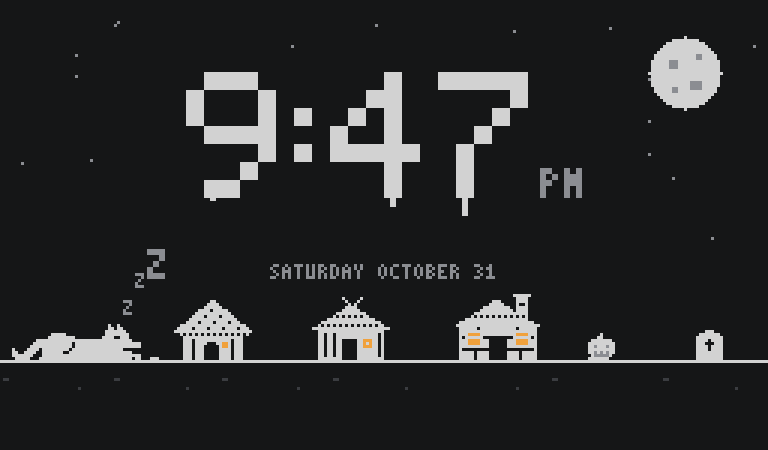
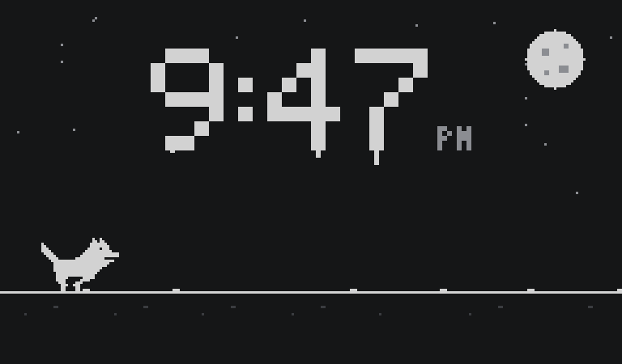
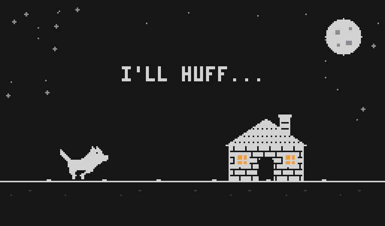
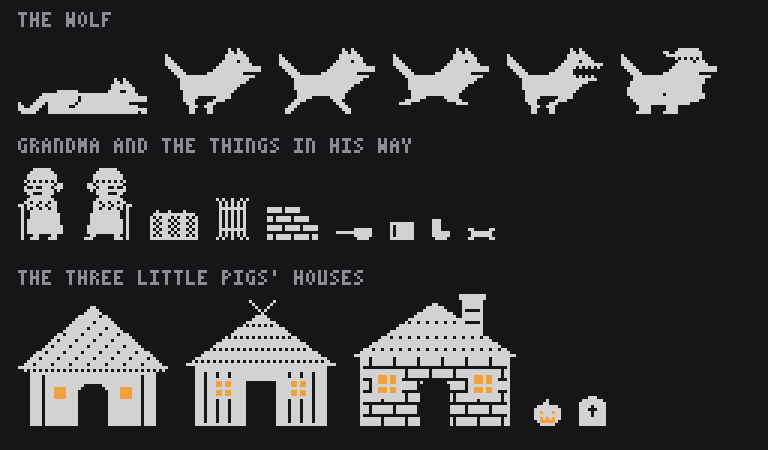

# Wolf Run

[](https://github.com/tctibbs/wolf-run/actions/workflows/ci.yml)

I made Wolf Run for a Halloween escape room I hosted. It runs on a Raspberry Pi with
a small touchscreen that sits in the living room.

Most of the night it's a clock, with the Big Bad Wolf asleep in the corner. When it's
time, he wakes up and the screen asks for a button. Press it and you're the wolf,
chasing Grandma as she runs to the straw house, then the stick house, then the brick
house. It plays a lot like the Chrome dinosaur game: tap to hop, hold to jump higher,
and each house is faster than the last. Catch her and the screen cuts to a live
camera.








## Running it

```bash
uv sync
uv run wolf-run screen --windowed
```

Ctrl+P (Cmd+P on a Mac) wakes the wolf, then any key plays. Ctrl+E skips to the brick
house, Ctrl+R resets, and Ctrl+Q quits.

For the camera at the end, copy `.env.example` to `.env` and fill in your RTSP
camera. `uv run wolf-run camera-check` tells you if it's working.

## Sprites



## Hardware

A Raspberry Pi 3, a 1024x600 touchscreen, a Reolink E1 Zoom camera, and a big red USB
button.
