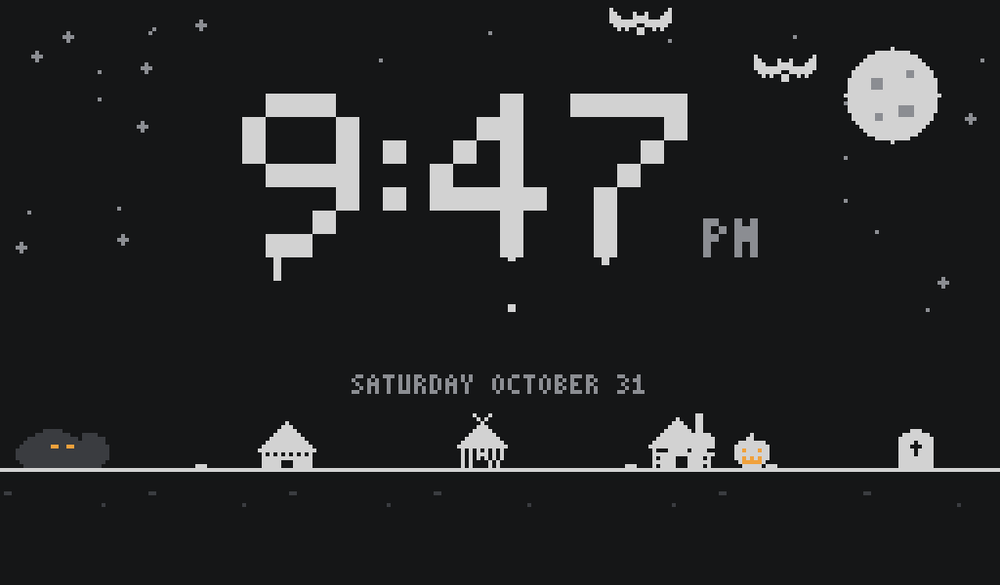
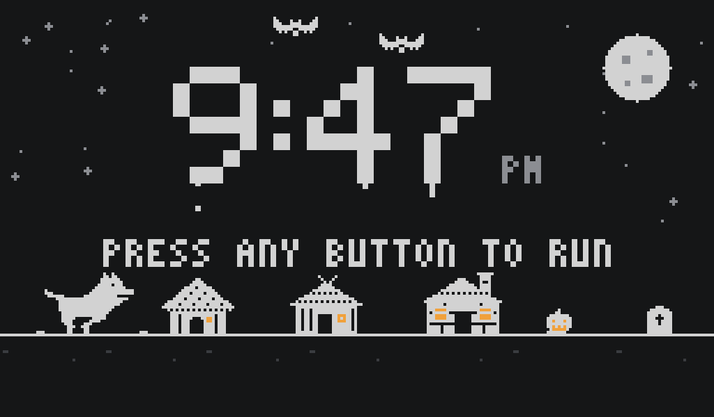

# Wolf Run

A little party screen for a Halloween escape room, built for a Raspberry Pi with a
touchscreen.

Most of the night it's just a clock in the corner of the living room, with the wolf
curled up asleep beside it. Then something in the game sets it off: the wolf wakes
up, gets to his feet, and the screen tells you to press any button. Do it, and the
clock turns into a retro runner, the kind you play
when the internet goes down. You're the Big Bad Wolf. Jump the straw, the sticks and
the bricks, make it all the way to Grandma's house, and... well, he eats her. Then
the screen crackles into static and cuts to a live feed from the basement camera.

| Asleep | Primed |
|---|---|
|  |  |

## The three stages

| Stage | What's on screen | Status |
|---|---|---|
| 1. Clock | The time, dripping, with bats, a moon, and the wolf asleep | Done |
| 1b. Primed | The wolf wakes up and the screen says to press any button | Done |
| 2. Wolf Run | Three houses, three levels, and Grandma as dinner | Done (sound to come) |
| 3. The basement | A live camera feed, security-camera style | Done |

## Getting started

You'll need [uv](https://docs.astral.sh/uv/).

```bash
uv sync
cp .env.example .env    # then fill in your camera's address and login
uv run wolf-run camera-check
```

`camera-check` grabs one frame from the camera and saves it to
`snapshots/camera-check.jpg`, so you can see it's really working.

To see the screen itself:

```bash
uv run wolf-run screen --windowed                    # a 1024x600 window; Esc closes
uv run wolf-run screenshot --at "2026-10-31 21:47"   # one frame, saved as a PNG
uv run wolf-run screenshot --seconds 6 --primed 2.5  # the same, primed 2.5 seconds ago
```

## Playing it

Any key, click, or tap is "the button". Hold it to jump higher, like the dinosaur
game; a quick tap is a short hop.

Grandma runs off and hides in the straw hut, then the stick house, then the brick
house. Each house is a level. Reach one and the wolf huffs and puffs it down, and
Grandma runs on to the next. Crash and you start that level again, not the whole
game. The brick house won't blow down, so the wolf goes down the chimney instead.
A perfect run takes under two minutes; expect about five with practice.

The host's controls need Ctrl (Cmd on a Mac), so a guest mashing keys can't hit
them:

| Keys | Does |
|---|---|
| Ctrl+P | Prime the screen: the wolf wakes up and asks for the button |
| Ctrl+R | Back to the sleeping clock |
| Ctrl+E | Skip to the brick house |
| Ctrl+Q | Quit |

## Private stuff stays private

The camera's address and login live in `.env`, which git ignores. The repo only has
`.env.example`, with made-up values. Snapshots are ignored too.

## Hardware

- Raspberry Pi 3 with a 1024x600 touchscreen
- Reolink E1 Zoom camera, read over RTSP (the small "sub" stream is plenty for a Pi 3)
- Home Assistant to kick things off and to override anything that gets stuck

## Development

```bash
uv run pytest
uv run ruff check
uv run ruff format
```
